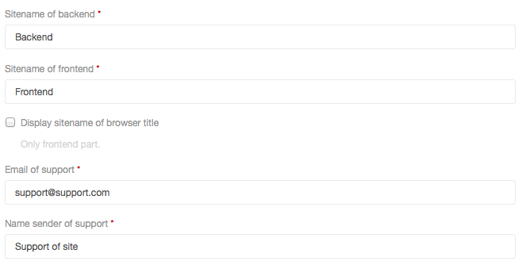

# yii2-config

Installation
------------

The preferred way to install this extension is through [composer](http://getcomposer.org/download/).

Either run

```
php composer.phar require --prefer-dist bupy7/yii2-config "*"
```

or add

```
"bupy7/yii2-config": "*"
```

to the require section of your `composer.json` file.


Usage
-----

Run migration:

```
./yii migrate/up --migrationPath=@bupy7/config/migrations 
```

Added to console application config:

```php
'controllerMap' => [
    ...

    'config' => [
        'class' => 'bupy7\config\commands\ManagerController',
    ],

    ...
],
```

Added to main application config:

```php
'bootstrap' => [
    ...

    'config',

    ...
],
'modules' => [
    'config' => [
        'class' => 'bupy7\config\Module',
        'enableCaching' => !YII_DEBUG,
        'as access' => [
            'class' => AccessControl::className(),
            'rules' => [
                [
                    'allow' => true,
                    'roles' => ['admin'],
                ],
            ],
        ],
    ],
],
'components' => [
    'configManager' => [
        'class' => 'bupy7\config\components\ConfigManager',
    ],
],
```

Install demo parameters:

```
./yii config/init
```

Config manager allowed by URL: 

```
config/default/index
```

### Adding config parameters

All parameters **required** must be content following options:

- `module` *(string)* - Name of module parameter where it will be use (app, 
shop, cart, blog, news and etc.).
- `name` *(string)* - Name of parameter (mainPageTitle, adminEmail and etc.).

> Module name and name must be unique.

- `label` *(string)* - Label of parameter. It must be translation message. More info 
to `Yii::t()`.
- `type` *(integer)* - Type of field (`bupy7\config\Module::TYPE_INPUT`, 
`bupy7\config\Module::TYPE_TEXT` and etc). Allowed type field you can see to 
`bupy7\config\Module`.

- `language` *(integer)* - Language for which this config parameter will be uses (
`bupy7\config\Module::LANGUAGE_RU`, `bupy7\config\Module::LANGUAGE_ALL` and etc).
- `rules` *(array)* - Rules of field. All rules must be specified without field name.
Example: 
```php
'rules' => [
    ['required'],
    ['string', 'max' => 255],
], 
```
More info to `bupy7\config\models\Config::afterFind()`. 

Additional options:

- `value` *(string)* -  Value of config parameter.
- `options` *(array)* - Options depend of field type. More info to 
`bupy7\config\widgets\ActiveForm::field()`.
Example for ```textInput``` type:
```php
'options' => [
    ['maxlength' => true]
],
```
- `hint` *(string)* - Hint of field. It must be translation message. More info 
to `Yii::t()`.

Example:

```php
use bupy7\config\Module as ConfigModule;

...
'modules' => [

    ...

    'config' => [
        'class' => 'bupy7\config\Module',
        'enableCaching' => !YII_DEBUG,
        'as access' => [
            'class' => AccessControl::className(),
            'rules' => [
                [
                    'allow' => true,
                    'roles' => ['admin'],
                ],
            ],
        ],
        'params' => [
            [
                'module' => 'app', 
                'name' => 'backendSitename', 
                'label' => 'PARAM_BACKEND_SITENAME', 
                'value' => 'Backend', 
                'type' => ConfigModule::TYPE_INPUT, 
                'language' => ConfigModule::LANGUAGE_RU,
                'rules' => [
                    ['required'],
                    ['string', 'max' => 255],
                ], 
                'options' => [
                    ['maxlength' => true]
                ],
            ],
            [
                'module' => 'app', 
                'name' => 'frontendSitename', 
                'label' => 'PARAM_FRONTEND_SITENAME', 
                'value' => 'Frontend', 
                'type' => ConfigModule::TYPE_INPUT, 
                'language' => ConfigModule::LANGUAGE_RU,
                'rules' => [
                    ['required'],
                    ['string', 'max' => 255],
                ], 
                'options' => [
                    ['maxlength' => true]
                ],
            ],            
            [
                'module' => 'app', 
                'name' => 'displaySitename', 
                'label' => 'PARAM_DISPLAY_SITENAME', 
                'value' => '0', 
                'type' => ConfigModule::TYPE_YES_NO, 
                'language' => ConfigModule::LANGUAGE_ALL, 
                'rules' => [
                    ['boolean'],
                ], 
                'hint' => 'HINT_PARAM_DISPLAY_SITENAME',
            ],
            [
                'module' => 'app', 
                'name' => 'supportEmail', 
                'label' => 'PARAM_SUPPORT_EMAIL', 
                'value' => 'support@support.com', 
                'type' => ConfigModule::TYPE_INPUT, 
                'language' => ConfigModule::LANGUAGE_RU, 
                'rules' => [
                    ['required'],
                    ['email'],
                ],
            ],
            [
                'module' => 'app', 
                'name' => 'supportNameEmail', 
                'label' => 'PARAM_SUPPORT_NAME_EMAIL', 
                'value' => 'Support of site', 
                'type' => ConfigModule::TYPE_INPUT, 
                'language' => ConfigModule::LANGUAGE_RU, 
                'rules' => [
                    ['required'],
                    ['string', 'max' => 255],
                ],
                'options' => [
                    ['maxlength' => true]
                ],
            ],
        ],
    ],

    ...

],
```

After added configuration parameters run rescan:

```
./yii config/rescan
```

Result:



##License

yii2-config is released under the BSD 3-Clause License.